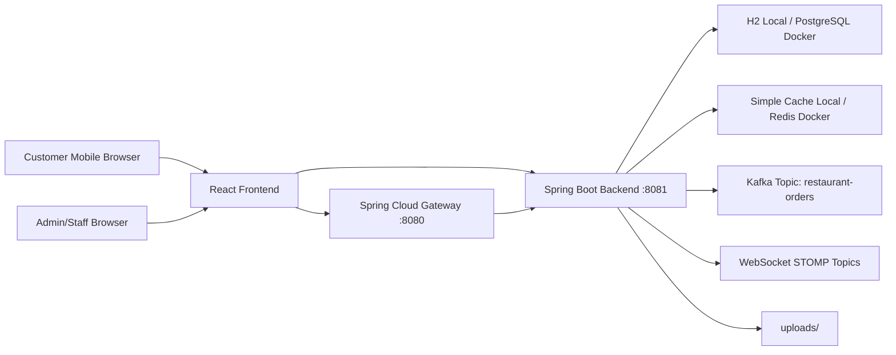
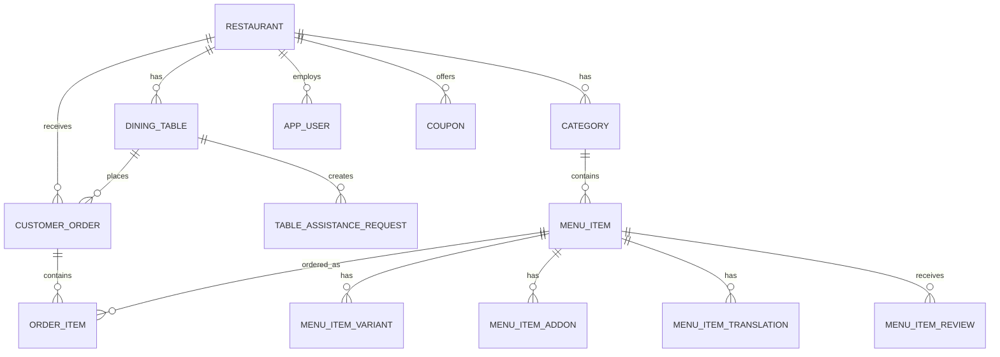
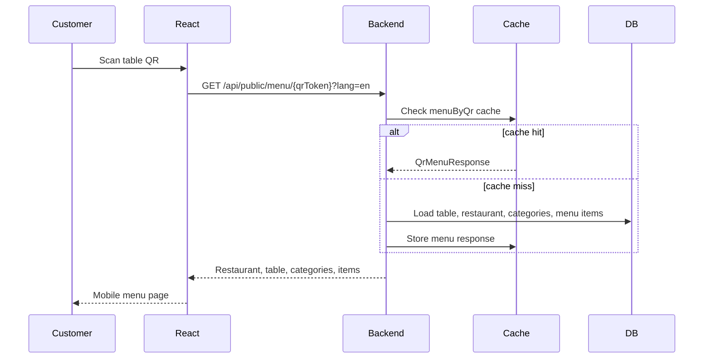
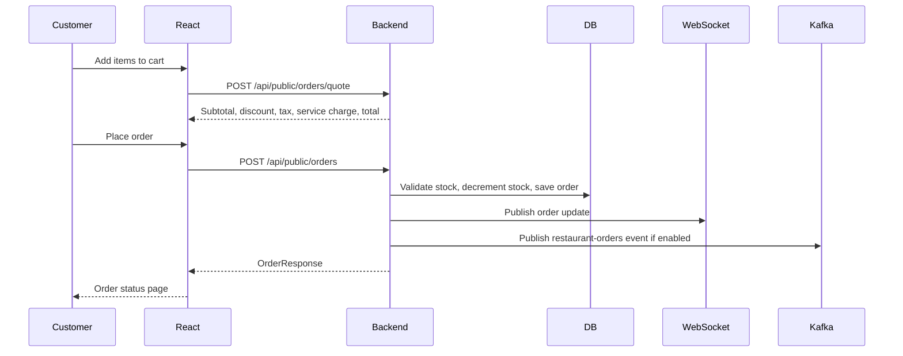
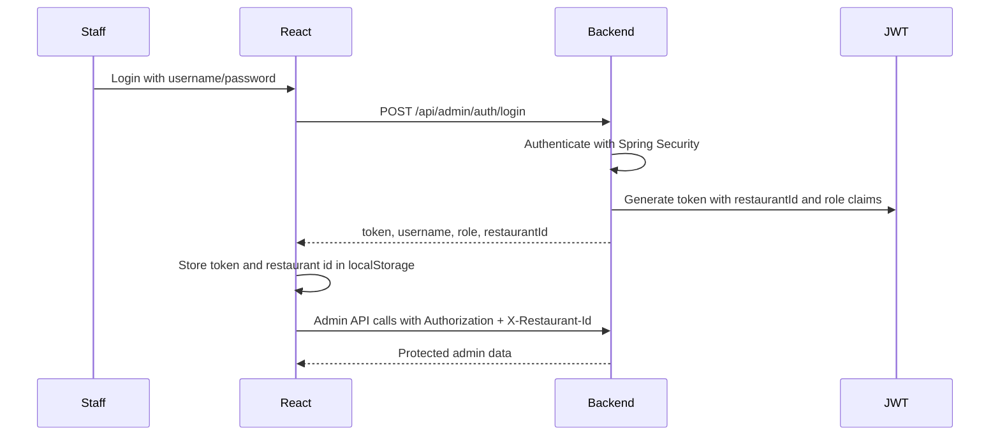
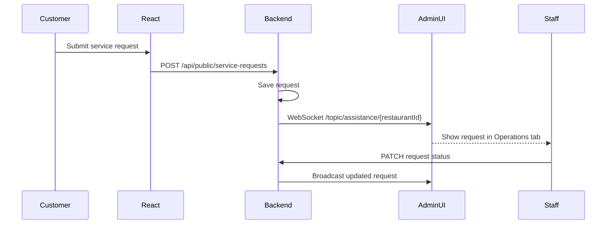

# QR-Based Restaurant Menu & Ordering System Documentation

## 1. Project Overview

This project is a full-stack restaurant menu and ordering platform where customers scan a table-specific QR code, browse the restaurant menu, add items to cart, apply coupons, place orders, track order status, request assistance, view bills, and submit reviews.

Restaurant staff use a secured admin console to manage menu setup, table QR codes, stock, coupons, kitchen operations, order lifecycle, payments, reviews, analytics, and staff accounts.

The system is built to be microservices-ready. Today it runs as a Spring Boot backend, React frontend, and optional Spring Cloud Gateway, with Docker Compose support for PostgreSQL, Redis, Kafka, and Zookeeper.

## 2. Tech Stack

| Layer | Technology | Purpose |
|---|---|---|
| Backend | Java 17, Spring Boot | REST APIs, business logic, WebSocket events |
| Security | Spring Security, JWT | Admin login, role-based access control |
| Persistence | Spring Data JPA, Hibernate | Entity mapping and repository layer |
| Local Database | H2 | Local development without installing PostgreSQL |
| Docker Database | PostgreSQL 16 | Production-like database in Docker |
| Cache | Spring Cache, Redis | Fast QR menu loading in Docker profile |
| Local Cache | Spring simple cache | Local cache without Redis |
| Messaging | Kafka, Zookeeper | Publishes order lifecycle events |
| Realtime | WebSocket, STOMP, SockJS | Live order, assistance, and table-session updates |
| Rate Limiting | Bucket4j | Per-IP API rate limiting |
| API Gateway | Spring Cloud Gateway | Routes API, WebSocket, Swagger, and frontend traffic |
| Frontend | React 18, Vite | Public customer UI and admin console |
| Styling | Tailwind CSS | Mobile-first responsive UI |
| Deployment | Docker, Docker Compose | Full local orchestration |
| PWA | Manifest, service worker | Installable frontend shell with offline fallback |

## 3. Repository Structure

```text
2026-04-18-build-a-full-stack-qr-based/
  backend/
    src/main/java/com/restaurant/ordering/
      config/
      controller/
      dto/
      entity/
      enums/
      exception/
      mapper/
      repository/
      security/
      service/
    src/main/resources/
      application.yml
      application-local.yml
      application-docker.yml
  frontend/
    public/
      icon.svg
      manifest.webmanifest
      offline.html
      sw.js
    src/
      api/
      components/
      context/
      layouts/
      pages/
      utils/
  gateway/
    src/main/resources/application.yml
  uploads/
  docker-compose.yml
  README.md
  PROJECT_DOCUMENTATION.md
```

## 4. High-Level Architecture



The frontend can call the backend directly on `http://localhost:8081` during local development. In Docker, the frontend is configured to use the gateway on `http://localhost:8080`.

## 5. Runtime Profiles

### Local Profile

The backend defaults to the `local` profile.

Used for:

- Running backend from IntelliJ
- Running without PostgreSQL, Redis, or Kafka installed locally
- Fast development and debugging

Local profile behavior:

- Database: H2 in-memory
- Cache: Spring simple cache
- Kafka publishing: disabled
- H2 console: enabled at `/h2-console`
- Public base URL defaults to a network IP style URL through `APP_PUBLIC_BASE_URL`, with fallback configured in `application-local.yml`

### Docker Profile

The `docker` profile is used by Docker Compose.

Docker profile behavior:

- Database: PostgreSQL
- Cache: Redis
- Kafka publishing: enabled
- Kafka bootstrap server: `kafka:9092`
- Backend connects to Docker service names like `postgres`, `redis`, and `kafka`

## 6. Main User Roles

The system supports these admin/staff roles:

| Role | Purpose |
|---|---|
| `ADMIN` | Full access, staff account creation, menu, orders, analytics |
| `MANAGER` | Operations and service management |
| `KITCHEN` | Kitchen board and order preparation flow |
| `CASHIER` | Payment status and billing operations |

Current route security allows all four roles to access authenticated admin APIs, while staff-management endpoints are restricted to `ADMIN`.

Seeded users:

| Username | Password | Role |
|---|---|---|
| `admin` | `admin123` | `ADMIN` |
| `manager` | `manager123` | `MANAGER` |
| `kitchen` | `kitchen123` | `KITCHEN` |
| `cashier` | `cashier123` | `CASHIER` |

## 7. Database Design

### Core Entities

| Entity | Description |
|---|---|
| `Restaurant` | Restaurant tenant, name, slug, description, logo URL |
| `DiningTable` | Restaurant table, table number, unique QR token |
| `Category` | Food category such as Veg, Non-Veg, Drinks |
| `MenuItem` | Main food item with name, price, image, availability, vegetarian flag, stock, ETA |
| `MenuItemVariant` | Size or portion option with price adjustment, stock, availability, ETA |
| `MenuItemAddon` | Optional add-on with price, stock, availability, ETA |
| `MenuItemTranslation` | Translated menu item name and description |
| `CustomerOrder` | Order header with table, status, totals, payment details, coupon, ETA |
| `OrderItem` | Ordered menu item, selected variant/add-ons, quantity, price, line total |
| `Coupon` | Discount rules by code, percentage/flat value, minimum amount, cap |
| `TableAssistanceRequest` | Waiter, water, bill, cleanup, or custom table request |
| `MenuItemReview` | Customer rating and review per menu item |
| `AppUser` | Admin/staff user with username, hashed password, role, restaurant id |

### Important Enums

| Enum | Values / Purpose |
|---|---|
| `OrderStatus` | `CREATED`, `CONFIRMED`, `PREPARING`, `READY`, `SERVED` |
| `PaymentStatus` | `PENDING`, `PAID` |
| `PaymentMethod` | Payment method options including counter/online style flows |
| `Role` | `ADMIN`, `MANAGER`, `KITCHEN`, `CASHIER` |
| `AssistanceRequestStatus` | Table request lifecycle |
| `AssistanceRequestType` | Type of service request |

### Relationship Summary



## 8. Backend Layering

The backend follows a clean layered structure:

```text
Controller -> Service -> Repository -> Entity/Database
              |
              -> Mapper -> DTO
```

### Controller Layer

Controllers expose HTTP endpoints and keep request handling thin.

Examples:

- `PublicMenuController`
- `AuthController`
- `AdminMenuController`
- `AdminOrderController`
- `AdminOpsController`
- `AdminAnalyticsController`
- `AdminStaffController`

### Service Layer

Services contain business logic.

Examples:

- `MenuService`: menu loading, menu CRUD, QR generation, image URLs, caching
- `OrderService`: order creation, stock decrement, pricing, coupon application, payment status, order lifecycle
- `CouponService`: coupon validation and management
- `AssistanceRequestService`: waiter/bill/service requests and table sessions
- `ReviewService`: ratings and reviews
- `AnalyticsService`: revenue, top sellers, hourly order analytics
- `StaffService`: staff listing and creation
- `OrderEventPublisher`: WebSocket and Kafka event publishing

### Repository Layer

Repositories use Spring Data JPA.

Examples:

- `RestaurantRepository`
- `DiningTableRepository`
- `CategoryRepository`
- `MenuItemRepository`
- `OrderRepository`
- `OrderItemRepository`
- `CouponRepository`
- `UserRepository`
- `MenuItemReviewRepository`

### DTO Layer

DTOs keep API contracts separate from JPA entities.

Examples:

- `OrderRequest`
- `OrderResponse`
- `OrderQuoteRequest`
- `OrderQuoteResponse`
- `MenuItemRequest`
- `MenuItemResponse`
- `FinalBillResponse`
- `AnalyticsSummaryResponse`
- `StaffCreateRequest`
- `StaffResponse`

## 9. QR Menu Flow



QR links use table-specific tokens such as:

```text
/menu/saffron-table-t1
/menu/saffron-table-t2
```

Each token maps to a `DiningTable`. This lets the system auto-fill the table number during checkout.

## 10. Customer Ordering Flow



During order creation:

- Backend validates the QR token.
- Backend validates item availability.
- Backend validates base item stock.
- Backend validates selected variant and add-on stock.
- Backend calculates subtotal.
- Backend applies coupon if valid.
- Backend calculates tax and service charge.
- Backend stores the order and order items.
- Backend decrements stock.
- Backend clears menu cache so availability remains fresh.
- Backend broadcasts live updates through WebSocket.
- Backend publishes Kafka order event when enabled.

## 11. Order Lifecycle

Orders move through this lifecycle:

```text
CREATED -> CONFIRMED -> PREPARING -> READY -> SERVED
```

The admin console can update the status. Invalid transitions are rejected by backend validation.

Kitchen board focuses on active kitchen statuses:

```text
CONFIRMED
PREPARING
READY
```

## 12. Payment and Billing Flow

The app supports pay-now simulation and pay-at-counter style flows.

Order pricing includes:

- Subtotal
- Discount
- Tax
- Service charge
- Payable total
- Paid/pending amount

Important endpoints:

```text
POST /api/public/orders/quote
GET  /api/public/bill/{qrToken}
GET  /api/admin/orders/bill/{qrToken}
PATCH /api/admin/orders/{id}/payment
```

When an order is marked paid:

- `paymentStatus` becomes `PAID`
- `paymentReference` is generated if not supplied
- Bill preview and final bill reflect paid and pending totals

## 13. Admin Console Flow



Frontend stores:

```text
adminToken
restaurantId
adminRole
adminUsername
```

Admin requests include:

```text
Authorization: Bearer <jwt>
X-Restaurant-Id: <restaurantId>
```

## 14. Admin Workspace Tabs

The admin UI is organized into workspace tabs:

| Tab | Purpose |
|---|---|
| Operations | Kitchen board, live orders, service requests |
| Menu Setup | Categories, menu items, stock, variants, add-ons, translations, images |
| Tables & Bills | Table sessions, final bill preview, QR code creation |
| Coupons | Coupon creation and coupon list |
| Growth | Reviews, ratings, recommendation signals |
| Platform | Analytics, staff accounts, CSV export, kitchen ticket printing |

## 15. Menu Management

Admins can manage:

- Categories
- Menu item name
- Description
- Price
- Image URL or uploaded image file
- Availability
- Vegetarian flag
- Base stock quantity
- Estimated preparation time
- Variants
- Add-ons
- Translations

When menu data changes:

- Backend persists changes through JPA.
- Backend evicts the `menuByQr` cache.
- Public menu reloads with the latest availability and pricing.

## 16. Stock Management

Stock is managed at multiple levels:

- Base menu item stock
- Variant stock
- Add-on stock

The customer cannot add/order more than available stock. During checkout, backend is the final source of truth and validates stock again.

When an order is placed:

- Base item stock is decremented by quantity.
- Selected variant stock is decremented by quantity.
- Selected add-on stock is decremented by quantity.
- Availability is recalculated based on remaining stock.
- Menu cache is cleared.

This prevents stale frontend cart state from creating invalid orders.

## 17. Coupons and Quote Flow

Coupons support:

- Code
- Description
- Percentage or flat discount
- Active/inactive flag
- Minimum order amount
- Maximum discount cap

Frontend calls quote before placing order:

```text
POST /api/public/orders/quote
```

The quote response lets customers see:

- Subtotal
- Discount
- Tax
- Service charge
- Total payable
- Applied coupon

## 18. Service Request Flow

Customers can request assistance from their table.

Examples:

- Call waiter
- Request water
- Request bill
- Cleanup
- Custom note

Flow:



## 19. Reviews and Growth Flow

After an order is served, customers can submit reviews.

Reviews include:

- QR token
- Menu item id
- Customer name
- Rating
- Comment

Reviews are used by:

- Public review display
- Admin Growth tab
- Menu item rating signals
- Recommendation ranking

## 20. Recommendations

The backend exposes:

```text
GET /api/public/recommendations/{qrToken}?lang=en
```

Recommendations are based on menu signals such as:

- Average rating
- Review count
- Order count
- Availability

The frontend displays recommendations on the public menu page.

## 21. Analytics

Phase 5 adds restaurant analytics.

Endpoint:

```text
GET /api/admin/analytics/summary
```

The response includes:

- Total revenue
- Paid revenue
- Pending revenue
- Total orders
- Served orders
- Active orders
- Pending payments
- Average ticket
- Top selling items
- Hourly orders and revenue

The Admin Platform tab renders this data as cards and lists.

## 22. Staff Management

Phase 5 adds staff account management.

Endpoints:

```text
GET  /api/admin/staff
POST /api/admin/staff
```

Only `ADMIN` users can access staff management.

Staff creation stores:

- Username
- BCrypt-hashed password
- Role
- Restaurant id

## 23. Image Uploads

Admins can upload menu item images.

Endpoint:

```text
POST /api/admin/menu-items/image-upload
```

Behavior:

- Frontend sends multipart form data.
- Backend stores the uploaded file under `uploads/`.
- Backend returns a public image URL.
- Menu item stores the image URL.
- Static access to `/uploads/**` is permitted by security configuration.

## 24. Redis Caching

Menu loading is cached with Spring Cache.

Cache name:

```text
menuByQr
```

Cache key:

```text
qrToken + ":" + languageCode
```

Local behavior:

- Uses simple in-memory cache.
- No Redis required.

Docker behavior:

- Uses Redis.
- Redis runs as Docker service `redis`.
- Backend connects through `spring.data.redis.host=redis`.

Cache is evicted when:

- Menu items are created/updated/deleted.
- Availability changes.
- Orders decrement stock.
- Reviews update rating signals.

## 25. Kafka Messaging

Kafka is implemented as an order event publisher.

Topic:

```text
restaurant-orders
```

Producer:

```text
OrderEventPublisher
```

Payload:

```text
OrderResponse
```

Key:

```text
order id
```

When an order is created or updated, backend calls:

```text
kafkaTemplate.send("restaurant-orders", orderResponse.id().toString(), orderResponse)
```

Kafka is controlled by:

```yaml
app:
  kafka:
    enabled: true
```

Profile behavior:

- Local profile: Kafka disabled
- Docker profile: Kafka enabled

Current Kafka scope:

- Producer is implemented.
- Topic auto-creation is enabled in Docker Compose.
- No consumer service is currently implemented.

Future consumer examples:

- Kitchen analytics service
- Notification service
- Payment reconciliation service
- Data warehouse/event archive

## 26. WebSocket Realtime Updates

WebSockets use STOMP over SockJS.

Endpoint:

```text
/ws/orders
```

Broker prefix:

```text
/topic
```

Published topics:

| Topic | Purpose |
|---|---|
| `/topic/orders/{restaurantId}` | Admin receives restaurant-wide order updates |
| `/topic/orders/table/{qrToken}` | Customer receives table-specific order updates |
| `/topic/assistance/{restaurantId}` | Admin receives service request updates |
| `/topic/assistance/table/{qrToken}` | Customer/table-specific assistance updates |
| `/topic/table-sessions/{restaurantId}` | Admin receives table session updates |

Frontend uses:

- `@stomp/stompjs`
- `sockjs-client`

## 27. Rate Limiting

The backend includes a Bucket4j filter.

Current limit:

```text
100 requests per IP per minute
```

If the limit is exceeded:

```text
HTTP 429 Too Many Requests
Rate limit exceeded
```

The current implementation stores buckets in memory. For multi-instance deployment, this can be moved to Redis-backed distributed rate limiting.

## 28. Security Design

### Public APIs

Public endpoints do not require login:

```text
/api/public/**
/uploads/**
/ws/**
/swagger-ui/**
/v3/api-docs/**
```

### Admin APIs

Admin APIs require JWT:

```text
/api/admin/**
```

JWT contains:

- Subject: username
- `restaurantId`
- `role`
- Expiration

Spring Security converts the role claim into authorities such as:

```text
ROLE_ADMIN
ROLE_MANAGER
ROLE_KITCHEN
ROLE_CASHIER
```

### Password Storage

Passwords are stored using BCrypt hashing.

## 29. API Reference

### Public APIs

| Method | Endpoint | Description |
|---|---|---|
| `GET` | `/api/public/menu/{qrToken}` | Load QR menu |
| `GET` | `/api/public/recommendations/{qrToken}` | Load recommended items |
| `POST` | `/api/public/orders` | Place order |
| `POST` | `/api/public/orders/quote` | Calculate order quote |
| `GET` | `/api/public/orders/{qrToken}` | View table order history/status |
| `GET` | `/api/public/bill/{qrToken}` | View final bill |
| `POST` | `/api/public/service-requests` | Create table assistance request |
| `POST` | `/api/public/reviews` | Create item review |
| `GET` | `/api/public/reviews/{qrToken}` | View reviews for table/menu context |

### Auth APIs

| Method | Endpoint | Description |
|---|---|---|
| `POST` | `/api/admin/auth/login` | Login and receive JWT |

### Admin Menu APIs

| Method | Endpoint | Description |
|---|---|---|
| `GET` | `/api/admin/categories` | List categories |
| `POST` | `/api/admin/categories` | Create category |
| `PUT` | `/api/admin/categories/{id}` | Update category |
| `DELETE` | `/api/admin/categories/{id}` | Delete category |
| `GET` | `/api/admin/menu-items` | List menu items |
| `POST` | `/api/admin/menu-items` | Create menu item |
| `PUT` | `/api/admin/menu-items/{id}` | Update menu item |
| `PATCH` | `/api/admin/menu-items/{id}/availability` | Toggle availability |
| `DELETE` | `/api/admin/menu-items/{id}` | Delete menu item |
| `GET` | `/api/admin/menu-items/qr-codes` | Generate/list table QR codes |
| `POST` | `/api/admin/menu-items/image-upload` | Upload menu image |

### Admin Order APIs

| Method | Endpoint | Description |
|---|---|---|
| `GET` | `/api/admin/orders` | List all orders |
| `GET` | `/api/admin/orders/stats` | Order status counts |
| `PATCH` | `/api/admin/orders/{id}/status` | Update order status |
| `PATCH` | `/api/admin/orders/{id}/payment` | Update payment status |
| `GET` | `/api/admin/orders/bill/{qrToken}` | Admin bill preview |

### Admin Operations APIs

| Method | Endpoint | Description |
|---|---|---|
| `GET` | `/api/admin/ops/service-requests` | List assistance requests |
| `PATCH` | `/api/admin/ops/service-requests/{id}/status` | Update assistance request |
| `GET` | `/api/admin/ops/kitchen` | Active kitchen orders |
| `GET` | `/api/admin/ops/table-sessions` | Table session summary |
| `GET` | `/api/admin/ops/reviews` | Admin review list |

### Admin Commerce and Platform APIs

| Method | Endpoint | Description |
|---|---|---|
| `GET` | `/api/admin/coupons` | List coupons |
| `POST` | `/api/admin/coupons` | Create coupon |
| `POST` | `/api/admin/tables` | Create more tables |
| `GET` | `/api/admin/analytics/summary` | Analytics dashboard summary |
| `GET` | `/api/admin/staff` | List staff users |
| `POST` | `/api/admin/staff` | Create staff user |

## 30. Frontend Pages

| Page | Path | Purpose |
|---|---|---|
| `PublicMenuPage` | `/menu/:qrToken` | QR menu, search, filters, recommendations |
| `CartPage` | `/cart/:qrToken` | Cart and checkout |
| `OrderStatusPage` | `/orders/:qrToken` | Order status and reviews |
| `FinalBillPage` | `/bill/:qrToken` | Customer final bill |
| `AdminLoginPage` | `/admin/login` | Staff/admin login |
| `AdminDashboardPage` | `/admin` | Admin operations workspace |

## 31. Frontend State and API Connection

### API Client

The frontend API layer lives in:

```text
frontend/src/api/
```

The Axios client:

- Uses runtime API base URL
- Adds JWT authorization header
- Adds `X-Restaurant-Id`

### Auth Context

Auth state lives in:

```text
frontend/src/context/AuthContext.jsx
```

It manages:

- Token
- Restaurant id
- Username
- Role
- Login
- Logout

### Cart Context

Cart state lives in:

```text
frontend/src/context/CartContext.jsx
```

It manages:

- Selected items
- Quantities
- Variants
- Add-ons
- Max quantity rules from stock

## 32. PWA and Offline Support

PWA files:

```text
frontend/public/manifest.webmanifest
frontend/public/icon.svg
frontend/public/offline.html
frontend/public/sw.js
```

Frontend registers the service worker in production builds only.

Current offline behavior:

- App shell assets are cached.
- Navigation requests fall back to `offline.html` when offline.
- Live menu/order data still requires backend connection.

## 33. Docker Deployment

Start all services:

```bash
docker compose up --build
```

Services:

| Service | Port | Purpose |
|---|---:|---|
| `postgres` | `5432` | PostgreSQL database |
| `redis` | `6379` | Redis cache |
| `zookeeper` | `2181` | Kafka coordination |
| `kafka` | `9092` | Order event broker |
| `backend` | `8081` | Spring Boot API |
| `gateway` | `8080` | Gateway routing |
| `frontend` | `5173` | React UI |

Docker URLs:

```text
Frontend:  http://localhost:5173
Gateway:   http://localhost:8080
Backend:   http://localhost:8081
Swagger:   http://localhost:8080/swagger-ui.html
```

## 34. Local Development

### Backend with H2

Use IntelliJ or Maven:

```powershell
& "C:\Program Files\JetBrains\IntelliJ IDEA Community Edition 2025.2.6.1\plugins\maven\lib\maven3\bin\mvn.cmd" spring-boot:run
```

Local backend URLs:

```text
Backend:    http://localhost:8081
Swagger:    http://localhost:8081/swagger-ui.html
H2 Console: http://localhost:8081/h2-console
```

H2 JDBC URL:

```text
jdbc:h2:mem:restaurant_ordering
```

### Frontend

```powershell
npm.cmd install
npm.cmd run dev
```

Frontend URL:

```text
http://localhost:5173
```

### Gateway Local

If running gateway locally, make sure it uses local routing instead of Docker service names if a local profile/config is available.

## 35. End-to-End Happy Path

1. Backend starts and seeds restaurant, tables, menu, coupons, and users.
2. Admin logs in with `admin/admin123`.
3. Admin opens Tables & Bills and confirms QR links exist.
4. Customer opens `/menu/saffron-table-t1`.
5. Customer browses categories, searches, filters veg/non-veg, and adds items.
6. Customer applies coupon and calls quote.
7. Customer places order.
8. Backend validates stock, saves order, publishes WebSocket update, publishes Kafka event if enabled.
9. Admin sees order in Live Orders and Kitchen Board.
10. Staff changes status from `CREATED` to `CONFIRMED`, `PREPARING`, `READY`, then `SERVED`.
11. Customer order status updates.
12. Cashier marks payment as `PAID`.
13. Customer opens final bill.
14. Customer reviews menu items after service.
15. Admin sees analytics and review signals update.

## 36. Implemented Feature Phases

### Core

- QR menu access
- Public menu without login
- Categories, search, filters
- Cart and checkout
- Order placement
- Order status tracking
- Admin JWT login
- Menu/category CRUD
- Availability toggle
- Dynamic price updates
- Order lifecycle management
- Dockerized services

### Phase 1: Restaurant Operations

- Kitchen board
- Table service requests
- Table sessions
- WebSocket live operations
- Bill request flow

### Phase 2: Menu Intelligence and Stock

- Menu variants
- Add-ons
- Stock limits
- Admin stock management
- Estimated preparation time
- Quantity restriction based on stock

### Phase 3: Commerce

- Coupons
- Order quote
- Tax and service charge
- Payment status
- Payment reference
- Final bill
- Admin settlement/payment update flow

### Phase 4: Growth

- Reviews and ratings
- Recommendations
- Multilingual menu translations
- Rating/order-count signals

### Phase 5: Platform

- Staff roles
- Staff account creation
- Analytics dashboard
- Top seller analytics
- Hourly order analytics
- CSV export
- Printable kitchen tickets
- PWA manifest and offline fallback

## 37. Verification Performed

Frontend production build:

```powershell
npm.cmd run build
```

Result:

```text
Vite build succeeded.
```

Backend compile/test command:

```powershell
mvn test
```

Result:

```text
BUILD SUCCESS
No tests to run.
```

Note: The backend currently compiles successfully, but there is no automated backend test suite yet.

## 38. Current Limitations

- Kafka producer exists, but no Kafka consumer service is implemented yet.
- Local profile disables Kafka and Redis for simpler development.
- Rate limiting is in-memory and should be distributed for multi-instance production.
- Payment integration is simulated; Razorpay/Stripe are not yet connected.
- WebSocket broker uses Spring simple broker; production scale may need a broker relay.
- Staff role restrictions are partially enforced; staff-management is admin-only, but finer endpoint-level permissions can be added.
- H2 database is in-memory, so local data resets when backend restarts.

## 39. Recommended Next Improvements

- Add automated unit and integration tests.
- Add endpoint-level role permissions for kitchen/cashier/manager.
- Add real payment provider integration.
- Add Kafka consumers for notifications and analytics history.
- Add Flyway or Liquibase database migrations.
- Add production-grade distributed WebSocket broker.
- Add audit logs for admin actions.
- Add restaurant onboarding for SaaS multi-tenant mode.
- Add inventory low-stock alerts.
- Add printer integration for kitchen/KOT receipts.

